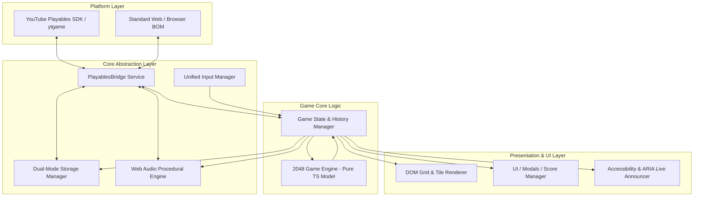

# 2048 Fusion — Software Architecture Specification
**Author / Developer:** Dulsan Vasantharaj  
**Role:** Principal Software Architect  
**Project:** 2048 Fusion  
**Version:** 1.0.0-rc  

---

## 1. Executive Summary & Design Philosophy

**2048 Fusion** is architected as an ultra-fast, zero-dependency, event-driven web game optimized for two primary targets:
1. **YouTube Playables Certification:** Strict adherence to the `ytgame` SDK lifecycle, memory budget (< 100 KiB total footprint), seamless pause/resume synchronization, platform audio priority, and sandbox data persistence.
2. **Modern Web & Vercel Deployment:** Clean mobile/desktop responsiveness, accessible DOM structure, PWA-ready resilience, and offline playability.

### Core Architectural Pillars
- **Decoupled Game Engine:** Pure TypeScript model with 0% DOM or rendering dependencies. Completely deterministic and 100% unit-testable.
- **Unified Reactive Input Layer:** Single abstraction translating Keyboard, Touch Swipes, Mouse Drags, and Gamepad into normalized directional intents.
- **Hardware-Accelerated Render Engine:** CSS Grid + 3D GPU Transforms (`translate3d`, `scale`) ensuring smooth 60/120 FPS tile transitions without Canvas font rasterization fuzziness on retina screens.
- **Procedural Audio Synthesizer:** Real-time Web Audio API oscillator synthesis yielding zero download latency, zero copyright liability, and dynamic pitch scaling.
- **Polymorphic Storage Bridge:** Transparent persistence interface routing to `ytgame.game.saveData/loadData` in Playables, and `localStorage` in standalone environments with schema versioning and corruption recovery.

---

## 2. High-Level Component & Module Architecture



---

## 3. Module Boundaries & Directory Structure

```text
2048-fusion/
├── .github/
│   └── workflows/
│       └── ci.yml               # Automated CI (build, lint, typecheck, tests)
├── docs/
│   ├── ACCESSIBILITY.md
│   ├── ARCHITECTURE.md
│   ├── BUGS.md
│   ├── CERTIFICATION_READINESS.md
│   ├── GAME_DESIGN.md
│   ├── PERFORMANCE.md
│   ├── PLAYABLES_INTEGRATION.md
│   ├── PROJECT_DISCOVERY.md
│   ├── RELEASE_CHECKLIST.md
│   ├── REQUIREMENTS.md
│   ├── SECURITY_PRIVACY.md
│   ├── TESTING.md
│   ├── THIRD_PARTY_LICENSES.md
│   └── YOUTUBE_PLAYABLES_REQUIREMENTS.md
├── src/
│   ├── core/                    # Pure deterministic game logic (Zero DOM)
│   │   ├── Board.ts             # 4x4 matrix operations, cell queries
│   │   ├── Engine.ts            # Move, merge, anti-double-merge, score, win/over
│   │   ├── Random.ts            # Deterministic/seeded tile spawn generator
│   │   └── Types.ts             # Direction, Cell, Tile, GameState, MoveResult
│   ├── platform/                # Platform integrations & bridges
│   │   ├── PlayablesBridge.ts   # ytgame lifecycle, firstFrameReady, pause/resume
│   │   └── StorageAdapter.ts    # Dual cloud-save & localStorage resilience
│   ├── audio/                   # Audio synthesis
│   │   └── AudioEngine.ts       # Web Audio API sound fx with platform mute sync
│   ├── input/                   # Unified input abstraction
│   │   └── InputManager.ts      # Keyboard, swipe vector math, mouse drag, debounce
│   ├── ui/                      # Presentation and DOM bindings
│   │   ├── BoardRenderer.ts     # Tile DOM management, GPU transforms, animations
│   │   ├── UIManager.ts         # Scores, modals (Win, Game Over, Settings, Info)
│   │   └── A11yAnnouncer.ts     # Screen-reader live regions & keyboard focus traps
│   ├── styles/                  # CSS Design System
│   │   ├── tokens.css           # Colors, typography, spacing, elevations
│   │   ├── board.css            # 4x4 grid layout, tile positions, animations
│   │   ├── ui.css               # Header, controls, dialogs, buttons
│   │   └── main.css             # Reset, responsive viewport, media queries
│   └── main.ts                  # Application bootstrap & lifecycle orchestrator
├── tests/                       # Automated test suites
│   ├── unit/
│   │   ├── Engine.test.ts       # Merge rules, anti-double-merge, edge cases
│   │   ├── Board.test.ts        # Matrix shifts, empty cell queries
│   │   └── Storage.test.ts      # Corrupt data recovery, serialization
│   └── mocks/
│       └── PlayablesMock.ts     # Mock ytgame environment for headless tests
├── index.html                   # Entry point with Playables SDK script tag
├── package.json                 # Minimal dependencies (Vite, TypeScript, Vitest)
├── tsconfig.json                # Strict TypeScript configuration
├── vercel.json                  # Vercel demo routing and security headers
├── vite.config.ts               # Bundler configuration (target ES2020, inline/zip)
└── README.md                    # Professional repository presentation
```

---

## 4. State Management & Data Flow

### 4.1 State Immutability & Event Loop
The game maintains a single source of truth (`GameState`):
```typescript
export interface GameState {
  version: number;
  grid: number[][];           // 4x4 matrix of tile values
  score: number;
  bestScore: number;
  isWon: boolean;
  isGameOver: boolean;
  hasContinued: boolean;
  moveHistory: BoardSnapshot[]; // For Undo capability
  settings: GameSettings;
  timestamp: number;
}
```

### 4.2 Move Transaction Cycle
1. **Input Dispatched:** `InputManager` detects swipe/arrow key $\rightarrow$ fires `onMove(Direction)`.
2. **Pause Guard:** If paused or in modal overlay $\rightarrow$ abort.
3. **Engine Evaluation:** `Engine.move(currentState, direction)` executes:
   - Compresses rows/columns.
   - Executes single-merge pass with value doubling.
   - Calculates score increment.
   - Verifies if board state changed.
4. **If Move Valid:**
   - Appends old state to `moveHistory` (capped at 1 for low memory).
   - Updates score and checks/updates `bestScore`.
   - Spawns a new tile (90% chance of 2, 10% chance of 4) in an empty cell.
   - Evaluates Win (`hasWon`) and Game Over (`isGameOver`).
   - Notifies `BoardRenderer` with delta instructions for slide/spawn/merge animations.
   - Notifies `AudioEngine` with sound trigger based on highest merged tile.
   - Triggers asynchronous debounced save via `StorageAdapter`.
   - If new best score, calls `PlayablesBridge.sendScore(bestScore)`.
5. **If Move Invalid:**
   - Triggers grid shake visual feedback.

---

## 5. Persistence Architecture & Corruption Resilience

The persistence layer guarantees **zero data loss** and **zero runtime crashes**:
- **Atomic Serialization:** Serializes minimal payload (< 1 KiB).
- **Validation Pipeline:**
  1. Check `data !== null` and `typeof data === 'string'`.
  2. Parse JSON inside `try / catch`.
  3. Validate schema types (`grid` is $4\times 4$ number array, `score >= 0`).
  4. If validation fails or data is corrupted: Log clean warning, initialize standard starting state, write clean state.
- **Playables Compliance:** Strictly waits for initial `loadData()` to resolve before allowing any `saveData()` writes.

---

## 6. Procedural Audio Engine Architecture

To guarantee strict compliance with YouTube Playables bundle size limits and eliminate third-party copyright concerns:
- Uses a unified singleton `AudioContext` created lazily on the first user interaction.
- Uses dynamic Gain nodes, Biquad filters, and Oscillators (`sine`, `triangle`).
- Harmonic Pitch Table for Merges:
  - 4: C4 (261.6 Hz)
  - 8: D4 (293.7 Hz)
  - 16: E4 (329.6 Hz)
  - 32: G4 (392.0 Hz)
  - 64: A4 (440.0 Hz)
  - 128: B4 (493.9 Hz)
  - 256: C5 (523.3 Hz)
  - 512: E5 (659.3 Hz)
  - 1024: G5 (784.0 Hz)
  - 2048: C6 Major Fanfare Arpeggio
- **Platform Audio Interceptor:** Listens directly to `ytgame.system.onAudioEnabledChange`. Clamps master gain instantly when platform audio is muted.

---

## 7. Architecture Risk Register

| Risk ID | Description | Severity | Probability | Mitigation Strategy |
| :--- | :--- | :--- | :--- | :--- |
| **RK-01** | Mobile swipe triggers browser pull-to-refresh or page scroll | High | High | Apply `touch-action: none` on the board container and call `e.preventDefault()` on registered pointer moves. |
| **RK-02** | Double merge bug (e.g. `[2, 2, 2, 2]` merging to `[8]`) | Critical | Low | Comprehensive automated unit test suite asserting strict anti-double merge rules. |
| **RK-03** | YouTube Playables pause event ignored, causing certification failure | Critical | Low | Dedicated `PlayablesBridge` subscribing to `onPause` / `onResume` freezing audio, inputs, and timers. |
| **RK-04** | Rapid swipe gestures queue multiple moves resulting in erratic animations | Medium | Medium | Movement lock / gesture debounce ensuring animation completes (~100ms) before accepting subsequent moves. |
| **RK-05** | Corrupt cloud save crashes game on startup | High | Low | Schema validation with safe fallback to new game initialization. |
| **RK-06** | Browser autoplay policy blocks Web Audio | Medium | High | Lazy initialization of `AudioContext` with user gesture listener (`touchstart`, `pointerdown`, `keydown`). |
