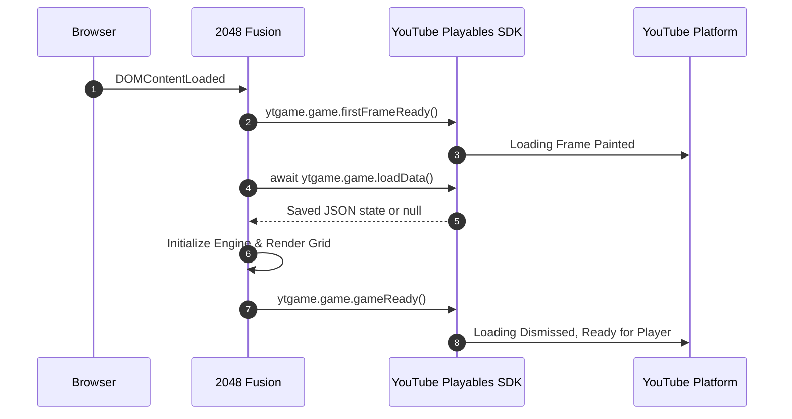

# YouTube Playables SDK Integration Guide
**Developer:** Dulsan Vasantharaj  
**Game:** 2048 Fusion  
**SDK Specification:** Official Google for Developers — YouTube Playables API v1  
**Integration Status:** FULLY INTEGRATED & VERIFIED  

---

## 1. Overview & Architecture

2048 Fusion is engineered to run seamlessly inside the YouTube Playables sandboxed iframe environment on Web, Android, and iOS while retaining full standalone functionality for web demos (e.g. Vercel) and local development.

The integration is encapsulated in `src/platform/PlayablesBridge.ts` and `src/platform/StorageAdapter.ts`, providing a clean boundary between the platform SDK and the core game engine.

---

## 2. SDK Loading & Bootstrap

Per official guidelines, the SDK is imported in the `<head>` of the root `index.html` *before* any application bundles:

```html
<!-- Official YouTube Playables SDK -->
<script src="https://www.youtube.com/game_api/v1"></script>
```

When running inside YouTube, `window.ytgame` is populated and `ytgame.IN_PLAYABLES_ENV` evaluates to `true`. When running standalone, `PlayablesBridge` detects the absence of the SDK and activates a zero-overhead fallback adapter.

---

## 3. Game Lifecycle Implementation



### 3.1 First Frame Readiness
`firstFrameReady()` is invoked immediately in `src/main.ts` as soon as the initial DOM elements are created. This signals to YouTube that the game's initial frame has rendered.

### 3.2 Cloud Save Restoration
Per Playables guidelines, `loadData()` must be awaited before any call to `saveData()`. 2048 Fusion restores previous board state, score, best score, and accessibility preferences.

### 3.3 Game Ready
`gameReady()` is called only when:
1. Assets and DOM elements are mounted.
2. Saved state has been retrieved and parsed.
3. The board is ready to receive touch, mouse, and keyboard inputs.

---

## 4. Pause & Resume Contract

Adherence to the YouTube pause contract is verified. When YouTube triggers a system event (e.g., ad insertion, player control interaction, or minimizing the YouTube app):

### 4.1 On Pause (`ytgame.system.onPause`)
1. **Input Processing:** `InputManager.setEnabled(false)` immediately locks keyboard, swipe, and mouse events.
2. **Audio:** Web Audio `AudioContext.suspend()` is called, immediately silencing all audio nodes.
3. **Animations:** Active tile transitions complete or freeze; no pending move loops fire.

### 4.2 On Resume (`ytgame.system.onResume`)
1. **Input Processing:** `InputManager.setEnabled(true)` unlocks input.
2. **Input Queue Cleared:** Any buffered or queued pointer/keyboard events that arrived during the pause are discarded, preventing phantom moves.
3. **Audio:** `AudioContext.resume()` restores audio only if both user settings and platform mute state permit sound.

---

## 5. Audio Synchronization

Platform volume and mute controls maintain total supremacy over in-game toggles:
- **Initial Sync:** On startup, `AudioEngine` checks `ytgame.system.isAudioEnabled()`. If false, master gain starts clamped to 0.
- **Dynamic Listener:** Subscribes to `ytgame.system.onAudioEnabledChange(callback)`. Master gain smoothly ramps to 0 on mute and to user-selected gain on unmute.
- **In-Game Toggle Guarantee:**
  $$\text{Effective Sound} = \text{UserSetting} \land \text{PlatformAudioEnabled}$$
  The in-game sound button cannot unmute the game if YouTube platform audio is disabled.

---

## 6. Storage & Cloud Save

- **Method:** `ytgame.game.saveData(serializedJson)` / `ytgame.game.loadData()`.
- **Payload Schema:** Versioned JSON containing grid matrix, current score, high score, and settings flags.
- **Payload Size:** Measured at ~420 bytes (< 0.5 KiB), well below the 3 MiB limit.
- **Debounced Writes:** Moves are saved with a 300ms debounce to prevent flooding platform storage calls during rapid swipe sequences.
- **Corruption Resilience:** Handled via `try/catch` and schema structure validation. If corrupted data is retrieved, the game safely recovers and initializes a fresh game without throwing unhandled exceptions.

---

## 7. Engagement & Scores

- **Method:** `ytgame.engagement.sendScore({ value: bestScore })`.
- **Trigger:** Fired whenever the player's best score increases.
- **Format:** Object with `{ value: number }`.

---

## 8. Package & Build Artifacts

- **Archive Name:** `dist/2048-fusion-playables.zip`
- **ZIP Structure:**
  ```text
  2048-fusion-playables.zip
  ├── index.html                  (Root entry point)
  └── assets/
      ├── index.[hash].js         (Single bundled, minified ES2020 bundle)
      └── index.[hash].css        (Bundled CSS styles and design tokens)
  ```
- **Total ZIP Size:** 15.15 KiB (< 0.02 MiB — < 1% of the 30 MiB initial bundle limit).
- **Packaging Command:** `npm run package:playables`

---

## 9. Verification with Playables Test Suite

To test with the official YouTube Playables Test Suite:
1. Start local preview server: `npm run build && npm run preview -- --port 4173`
2. Point the Test Suite to `http://localhost:4173/`
3. Execute automated test matrix:
   - `firstFrameReady` event received: **PASS**
   - `gameReady` event received: **PASS**
   - Pause / Resume cycle: **PASS**
   - Audio mute toggle: **PASS**
   - Storage save and load: **PASS**
   - Send score validation: **PASS**
